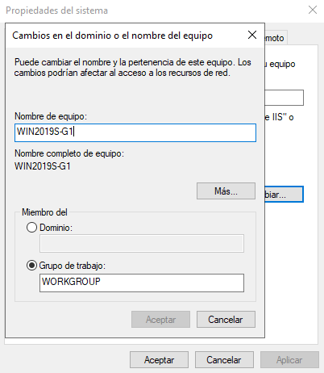

# SOR_MEDAC

# Práctica 1. Instalación Windows Server 2019 Essentials
Realizada por [María Ángeles Hita Cantón](https://github.com/shesaesir) y [Eric Ravira Villa](https://github.com/EricRV0502).

## Objetivos
- Características y requisitos del sistema operativo (Windows Server 2019 Essentials).
- Creación y configuración de la máquina virtual.
    - 3 MB.
    - 55 GB Disco Duro.
    - 2 procesadores al 90%.
- Instalación del SO en la máquina virtual.
    - Utilizar la contraseña de administrador: *Administrador1234*.
- Configuración básica.
    - Personalización entorno del servidor (nombre servidor, zona horaria).
    - Configuración de red.
- Conexión de equipos (Active Directory).
- Cortafuegos.

## Desarrollo de la práctica
Para las prácticas hemos utilizado el software de virtualización Oracle VM VirtualBox.

---

### Características y requisitos del sistema operativo (Windows Server 2019 Essentials).
Las caracterísitcas y requisitos básicos del sistema Windows Server 2019 Essentials son los siguientes:
* **Procesador mínimo**: 64 bits a 1,4 GHz.
* **RAM mínima**: 512 MB.
* **Espacio mínimo del disco duro**: 32 GB.
* **Interfaz gráfica de escritorio**: Opcional.
* Adaptador Ethernet con rendimiento de mínimo 1 gigabit por segundo.
* Teclado y ratón.
* Acceso a Intenert.

---

### Creación y configuración de la máquina virtual.

Para crear la máquina virtual y configurarla correctamente, es **recomendable** seguir los siguientes pasos:

1. Iniciamos el programa **Oracle VM VirtualBox**. En la ventana de incio cliclamos sobre **Nueva** para comenzar a crear la máquina virtual.

2. Aparecerá la siguiente ventana. En el campo **Nombre** pondremos el nombre que le daremos a nuestra máquina virtual, en este caso **Windows Server 2019**. En **Carpeta de la máquina** elegiremos dónde queremos almacenar los archivos de la máquina virtual. Es importante elegir el **tipo** de la máquina virtual que vamos a crear, en este caso se trata de Windows, por tanto debemos seleccionar **Microsoft Windows**. Por último, la **versión** elegida es la **Windows 2019 (64-bit)**. Una vez realizados los pasos, clicamos **Next**.

3. En la siguiente ventana es importante indicar la cantidad de memoria RAM que será reservada para la máquina virtual. El tamaño de memoria RAM que emplearemos es de **3 MB**. Una vez hecho, pulsamos **Next**.

4. En la ventana que aparecerá a continuación, debemos seleccionar la opción **Crear un disco duro virtual ahora**, al que poesteriomente le añadiremos GB. Pulsamos **Crear** para continuar a la siguiente ventana.

5. Seleccionamos el tipo de archivo de disco duro, en este caso al tener la imagen del sistem operativo, debemos escoger la primera opción, **VDI (VirtualBox Disk Image)**. Pulsamos **Next** para continuar con la instalación.

6. A continuación, en esta ventana nos da a elegir dos opciones haciendo referencia al almacenamiento del disdo duro que reservaremos para la máquina virtual. La opción que debemos seleccionar es **Tamaño fijo**, el motivo de esta selección es que el espacio asignado siempre será el mismo, es decir, **estático**. Pulsamos sobre **Next**.

7. Indicamos dónde estará ubicado el archivo y el tamaño de disco duro que se le proporcionará a la máquina. La ubicación es a gusto de cada usuario, mientras que los GB asignados a la máquina serán **55 GB**. Pulsamos sobre **Crear** y continuaremos con el último paso.

8. Por último, debemos asignar **dos procesadores** funcionando al **90%** a nuestra máquina virtual. Para ello, en la ventana de inicio de Oracle VM VirtualBox, seleccionamos la máquina recién creada y pulsamos sobre **Configuración**. En el menú de opciones nos dirigimos a **Sistema**, después clicamos sobre **Procesador**, seleccionamos dos procesadores y, respecto a **límite de ejecución** ponemos 90%. Pulsamos sobre **Aceptar** para guardar los cambios y ya tenemos nuestra máquina virtual lista para utilizar.

---

### Instalación del SO en la máquina virtual.

Para comenzar con la instalación del SO como tal, debemos dirigirnos a la ventana de inicio del programa Orable VM VirtualBox, donde seleccionaremos la máquina virtual que acabamos de crear y clicaremos sobre **Iniciar**.

La primera ventana que vemos al iniciar la máquina virtual es la siguiente, en la cual lo único que debemos seleccionar es el **idioma** que se empleará en el sistema operativo, la **fecha y hora** del país en el que estamos y, por último, el **idioma del teclado**, que, en este caso las tres opciones se tratan de **Español (España, internacional)**. Pulsamos sobre **Siguiente** para continuar.

A continuación nos muestra una ventana donde debemos clicar sobre **Instalar ahora** para comenzar la instalación y posterior configuración del sistema operativo Windows Server 2019.

Posteriormente, en la siguiente ventana observamos cuatro opciones disposibles. Es **muy importante** elegir la segunda opción, es decir **Windows Server 2019 Standard Evaluation (Experiencia de escritorio)**, el motivo por el cual se debe seleccionar esa opción es que si elegimos la primera, no tendremos una interfaz gráfica con la que manejar el sistema operativo, en cambio, escogiendo la segunda opción, tendremos un escritorio propio del sistema operativo de Windows. Pulsamos **Siguiente** y continuamos con la configuración.

Algo sencillo que debemos hacer a continuación, es **aceptar los términos de licencia** y hacer clic sobre **Siguiente**.

En esta ventana, debemos seleccionar qué **tipo de instalación** queremos. La opción más recomendada es **Personalizada: instalar solo Windows (avanzado)**.

Ahora, lo que debemos hacer es seleccionar la unidad a la cual queremos asignarle el sistema operativo Windows y pulsamos **Siguiente**.

Nos aparecerá la siguiente ventana el la cual se está instalando Windows. Esperamos hasta que finalice.

El último paso a realizar en la configuración previa de Windows Server 2019 es el siguiente: En el **Nombre de usuario** es posible poner cualquier nombre que cada usuario quiera. Respecto a la contraseña, nosotros hemos decidido escribir ***Administrador1234***, pero, al igual que el nombre de usuario, es a gusto de cada persona. Pulsamos sobre **Finalizar** y ya podremos acceder al escritorio de Windows y comenzar a utilizarlo.

Aquí podemos ver el **escritorio de Windows Server 2019 Essentials**.

---

### Configuración básica.

En este apartado se configurará el entorno del servidor, más concretamente el **nombre del servidor** y la **zona horaria**. Para comenzar la configuración, nos dirigimos al **menú de inicio** de nuestra máquina virtual y pulsamos sobre **Administrador del servicio**.

Nos aparecerá una ventana. Debemos dirigirnos hacia el menú de la izquierda y pulsar sobre **Servidor local** para poder cambiar el nombre del servidor y la zona horaria.

Para cambiar el nombre del servidor, debemos clicar sobre el nombre que posee actualmente. Nos aparecerá la siguiente ventana, en la cual pulsaremos sobre **Cambiar...**.

Nos aparecerá esta ventana, en la cual podremos ponerle al servidor el nombre que queramos. En este caso hemos elegido ***WIN2019S-G1*** como nombre del servidor. Pulsamos sobre **Aceptar** para aplicar y guardar los cambios realizados.

El proceso para cambiar la zona horaria es similar al anterior. Pulsamos sobre la **zona horaria actual**, donde encontraremos la siguiente ventana. Hacemos clic sobre **Cambiar zona horaria...** para proceder con el cambio.

Una vez se habré la siguiente ventana, elegimos la zona horaria que queremos emplear en nuestra máquina virtual. En este caso hemos elegido **(UTC+00:00) Dublín, Edimburgo, Lisboa, Londres**. Una vez hecho, pulsamos sobre **Aceptar** y ya hemos terminado de configurar el entorno del servidor.

---

Dentro de la configuración básica encontramos la **configuración de red**.

Para acceder a la configuración de red, lo primer paso a seguir se trata de acceder a la **configuración de Windows**. En el menú seleccionamos **Red e Internet** y nos dirigimos a **Ethernet**. Por último, hacemos clic sobre **Cambiar opciones del adaptador**.

Nos aparecerá la siguiente ventana, en la cual debemos hacer clic derecho sobre **Ethernet** y pulsar en **Propiedades**.

En la ventana que vemos a continuación, lo único que debemos hacer es hacer doble clic en **Protocolo de Internet versión 4 (TCP/IPv4)**. Al hacerlo se abrirá otra ventana donde podremos **configurar manualmente** nuestra IP, que en nuestro caso es la **191.168.0.101**. Respecto a la máscara hemos puesto **255.255.0.0** y en puerta **192.168.1.1.**.
Para el DNS, el **Servidor DNS preferido** es **208.67.222.222**, mientras que el **Servidor DNS alternativo** es **208.67.220.220**.
Pulsamos sobre **Aceptar** y la configuración de red se habrá completado.

---

### Conexión de equipos (Active Directory)

**Active Directory** se utiliza para la gestionón de equipos y diversos dipositivos dentro de la red de forma remota. En este apartado se explicará como habilitarlo.

Para comenzar la habilitación, debemos acceder desde el menú de inicio de Windows a **Administrador del servidor**. Posteriormente, hacemos clic sobre **Agregar roles y carcterísticas**.

La ventana que aparecerá a continuación es el **Asistente para agregar roles y características**. En el apartado **Tipo de instalación** seleccionaremos la opción **Instalación basada en características o en roles**. Hacemos clic sobre **Siguiente**.

A continuación en **Selección de servidor** escogemos la siguiente opción: **Selecionar un servidor del grupo de servidores** y procedemos a seleccionar nuestro servidor. Pulsamos **Siguiente**.

Una vez hecho, lo único que debemos hacer en esta ventana es seleccionar la casilla **Servicios de federación de Active Directory**. Hacemos clic en **Siguiente**.

Por último, le damos a **Instalar**.

---

### Cortafuegos.

A continuación se mostrará como configurar el **cortafuegos** de Windows Server 2019.

1. Lo primero que debemos hacer es acceder al panel de control y pulsar sobre **Sistema y seguridad**.

2. Una vez hecho, hacemos clic sobre **Firewall de Windows Defender**.

3. En la siguiente ventana nos aparecerá lo siguiente, en la cual debemos pulsar sobre **Cambiar la configuración de notificaciones**.

4. Nos aparecerá la siguiente ventana y en este caso, lo dejaremos tal cual.

