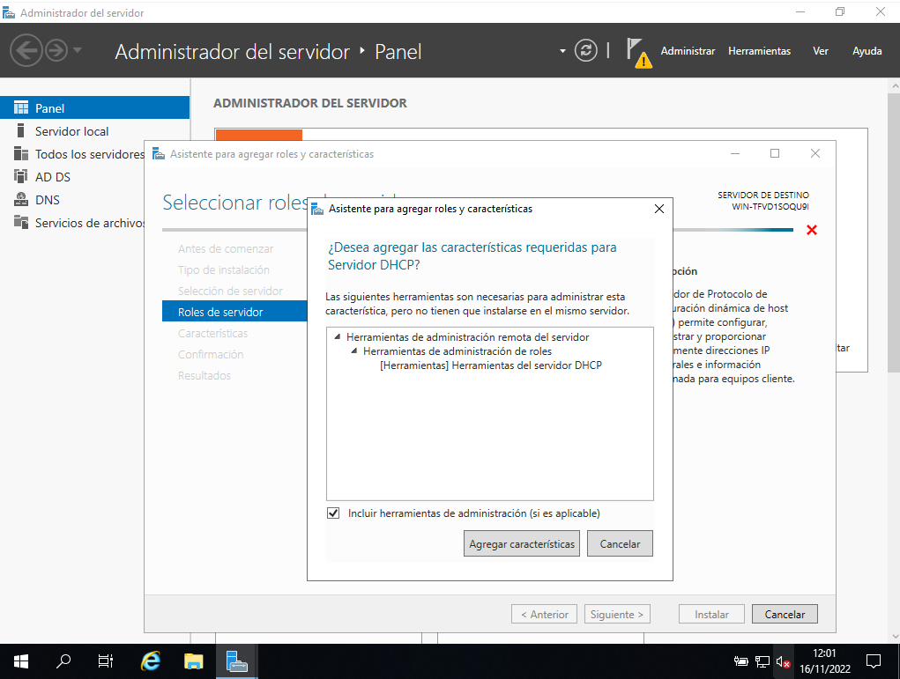

# SOR_MEDAC

# Práctica 2. Instalación y configuración de los servicios DNS y DHCP en Windows Server 2019 Essentials
Realizada por [María Ángeles Hita Cantón](https://github.com/shesaesir) y [Eric Ravira Villa](https://github.com/EricRV0502).

## Objetivos
- Breve explicación del servicio (**DNS** y **DHCP**).
    - ¿Qué es?
    - ¿Para qué sirve?
    - Etc.
- Proceso de instalación.
- Configuración básica.

## Desarrollo de la práctica
Para las prácticas hemos utilizado el software de virtualización Oracle VM VirtualBox.

---

### Breve explicación del servicio DNS.

El servicio **DNS** (Domain Name System) es un **protocolo** utilizado para la **traducción de un dominio**, es decir, una **URL** en su correspondiente **IP**.

- Algunas de las **ventajas** que presenta este protocolo son las siguientes:
    - **Facilidad para la navegación** a través de Internet, ya que a raíz del DNS no es necesario saber la dirección IP de cualquier sitio web que queramos visitar.
    - Ofrece **estabilidad**, puesto que si una dirección IP es modificada, **automáticamente se actualiza** en el sistema DNS.

- Asimismo, tiene diversos **inconvenientes**, pero en este caso se motrarán dos de ellos:
    - Existe la posibilidad de que hayan **ataques DNS** o que a la hora de la **redirección** a una página web, se dé el caso de que esta **no sea deseada**, es decir, redireccionar a una página no segura o no esperada por el usuario.
    - Si no se conoce la dirección IP de una página web, en caso de que el **servidor DNS no esté apto para su utilización**, no se podrá acceder a ella.

El servicio DNS es una **solución** principalmente para tres problemas ocasionados en grandes redes:
- **Organización**: Debido a la base de datos en la cual se almacenan los dominios y sus correspondientes IP, las búsquedas son más sencillas.
- **Escalabilidad**: Puesto que existen diversos servidores DNS, las búsquedas se dividen entre ellos.
- **Administración**: A raíz de la base de datos, es mucho más fácil a la hora de administrar y gestionar.

### Proceso de instalación del servicio DNS.

Para instalar el servicio DNS, en este caso en nuestra máquina virtual de Windows Server 2019 en el software Oracle VM VirtualBox, seguimos los siguientes pasos:
1. Debemos acceder al **Administrador del servidor** y pulsar sobre **Agregar roles y características** para comenzar con el proceso.

2. Se abrirá un asistente, en este caso **Asistente para agregar roles y características**. Hacemos clic en **Siguiente >**.

3. A continuación, nos guiará a la pestaña **Tipo de instalación**, en la cual seleccionamos la primera opción: **Instalación basada en características o en roles**. Pulsamos **Siguiente >**.

4. En la pestaña **Selección del servidor**, hacemos clic sobre la primera opción, es decir **Seleccionar un servidor del grupo de servidores**. En **Grupo de servidores** seleccionamos el servidor al gusto del usuario, en este caso **WIN-TFVD1S0QU9I**. Para continuar pulsamos **Siguiente >**.

5. En **Roles del servidor**, es muy importante que la opción **Servidor DNS** esté **marcada**. Pulsamos **Siguiente >**.

6. Antes de continuar, se abrirá la siguiente ventana en la cual en la parte de inferior vemos la siguiente opción, **Incluir herramientas de administración (si es aplicable)**, la marcamos y hacemos clic sobre **Agregar características**.

7. Si aparece la siguiente ventana, lo único que debemos hacer es pulsar **Continuar**.

8. A continuación apareceremos en la pestaña **Características**, en esta no tocamos nada, se deja tal cual y pulsamos **Siguiente >**.

9. En la pestaña **Confirmación**, la dejamos tal y como está. Pulsamos **Instalar** para dar comienzo a la instalación del servicio DNS.

10. Por últimos, se nos redigirá a la pestaña **Resultados**, en la cual aparecerá una barra en la parte superior, que nos indica el proceso de instalación, una vez esté completa, hacemos clic en **Cerrar**.

Aquí concluye el proceso de instalación del servicio DNS.

### Configuración básica del servicio DNS.

1. Para comenzar la configuración del servicio DNS, nos dirigimos a **Administrador del servidor**. En la parte izquierda de la ventana, observamos un pequeño menú, en el cual debemos pulsar sobre **DNS**, una vez dentro, seleccionamos el servidor, que en este caso es **WIN-TFVD1SOQU9I** y hacemos clic en **Heramientas** para empezar el proceso.

2. Se abrirá un menú despegable, pulsamos en **DNS**.

3. A continuación, aparecerá la siguiente ventana, **Administrador de DNS**. Hacemos **clic derecho** sobre el servidor, se abrirá el siguiente menú desplegable y debemos pulsar sobre **Configurar un servidor DNS...**.

4. Veremos que aparece el **Asistente para configurar un servidor DNS**. Hacemos clic en **Siguiente >**.

5. De las tres opciones que se nos ofrece, debemos escoger la primera, es decir **Crear una zona de búsqueda directa (recomendado para redes pequeñas)**. Pulsamos **Siguiente >** para continuar.

6. En esta ventana seleccionaremos la primera opción, la cual se denomina **Este servidor mantiene la zona**. Pulsamos **Siguiente >**.

7. A continuación, debemos escoger un nombre, en este caso es **medacZona.com**. Hacemos clic en **Siguiente >**.

8. Entre las dos opciones que aparecen, escogemos la primera, la cual es **Crear un archivo nuevo con este nombre de archivo:**, y justo debajo esribimos lo siguiente : **medacZona.com.dns**. Pulsamos **Siguiente >**.

9. En la siguiente ventana, debemos escoger la primera opción que aparece, **Permitir solo actualizaciones dinámicas seguras (recomendado para Active Directory)**. Hacemos clic en **Siguiente >**.

10. Posteriormente, debemos seleccionar **No, no reenviar consultas** y pulsar **Siguiente >**.

11. Por último, encontraremos la última ventana. Lo único que debemos hacer es pulsar sobre **Finalizar** para concluir con el proceso básico de la configuración del DNS.

---

### Breve explicación del servicio DHCP.

El servicio **DHCP** (Dynamic Host Configuration Protocol) es un protocolo enfocado en la **arquitectura cliente-servidor** encargado de **asignar IP dinámicamente** a los dispositivos conectados a una red. El protocolo DHCP utiliza los puertos 67 y 68.

- Estas son algunas de las **ventajas** que ofrece este protocolo:
    - Debido al servidor DHCP, las IP se asignan de forma **automática**, por lo tanto no es necesario hacerlo manualmente.
    - Al asignarlas de forma automática, en la medida de lo posible se evitan errores que pueden ocurrir cuando se hace de forma manual.
    - Algo que presenta un cambio muy significativo, es el hecho de que el **mantenimiento es mucho menor**, además, es **innecesario un administrador de sistemas**.

### Proceso de instalación del servicio DHCP.

Para instalar el servicio DHCP, debemos seguir los siguientes pasos:

1. No es necesario explicar el proceso de instalación detalle a detalle, puesto que comparte hasta el paso cinco con el servicio DNS. Lo único que cambia en el paso mencionado es lo siguiente: En la ventana **Roles del servidor**, marcamos la opción **Servidor DHCP**. Pulsamos **Siguiente >**.

2. Se abrirá la siguiente ventana, es importante marca la opción **Incluir herramientas de administración (si es aplicable)** que se encuentra en la parte inferior. Una vez hecho, hacemos clic en **Agregar características**.

3. En la pestaña **Características** que vemos a continuación, pulsamos **Siguiente >**, puesto que lo demás se deja tal cual está en un principio.

4. En la siguiente ventana, la cual se llama **Confirmación**, lo único que debemos hacer es pulsar sobre **Instalar** para dar comienzo a la instalación del servicio DHCP.

5. Por último, en **Resultados** veremos una barra en la parte superior, la cual debe completarse para dar por finalizada la instalación. Una vez esté completa, clicamos sobre **Cerrar**.

Una vez hayamos seguidos todos los pasos, habremos finalizado con éxito la instalación del servicio DHCP.

### Configuración básica del servicio DHCP.

Para dar comienzo a la configuración básica del servicio DHCP, debemos seguir los siguientes pasos:

1. Debemos abrir **Administrador del servidor**, una vez nos encontramos en esa ventana, hacemos clic sobre el **icono de bandera** que aparece en el menú de la parte superior.

2. Se desplegará un menú y deberemos pulsar sobre la primera opción que nos ofrece, es decir, **Completar configuración de DHCP**.

3. Se abrirá una nueva ventana, lo único que debemos hacer es pulsar **Confirmar**.

4. En la pestaña **Resumen**, debemos pulsar **Cerrar** para continuar.

5. A continuación, pulsamos el botón **Inicio** de Windows. Debemos buscar lo siguiente: **Herramientas administrativas** y hacer clic sobre esa misma opción.

6. En la ventana que se abrirá posteriormente, pulsamos sobre **DHCP**.

7. Por último, para finalizar la configuración básica del servicio DHCP, hacemos clic derecho sobre el servidor y nos dirigimos al apartado **Todas las tareas**, una vez ahí, pulsamos sobre **Reiniciar**.

Después de seguir los pasos, ya hemos terminado la configuración básica de DHCP.