# SOR_MEDAC

# Práctica 3. Administración de dominios en Windows Server 2019 Essentials
Realizada por [María Ángeles Hita Cantón](https://github.com/shesaesir).

## Objetivos
- Explicación sobre qué es un controlador de dominio y cuales son sus principales funciones.
    - FSMO.
    - Catálogo global.
- Herramientas de administración de dominios.
    - Herramientas principales.
    - Agrupación de herramientas.
- Dominio y controlador de dominio.
    - Instalación de un dominio básico.
    - Promover el dominio a controlador de dominio.
    - Degradar el controlador de dominio.

## Desarrollo de la práctica
Para las prácticas hemos utilizado el software de virtualización Oracle VM VirtualBox.

---

### Explicación sobre qué es un controlador de dominio y cuales son sus principales funciones.

Un **controlador de dominio** es un servidor en el cual se **almacena una réplica de un directorio***. En ese servidor se ejecuta el SO (Windows Server 2019 Essentials) y se ubican implementados los servicios de dominio Active Directory.

Las dos principales funciones de un controlador de dominio son las siguientes:
- **FSMO** (**Flexible Simple Master Operation**), o en español, roles de maestros de operación). Estos roles **evitan que sucedan conflictos en la replicación**, por ejemplo, cuando se cambia una contraseña, se crean unidades organizativas, etc. En caso de que el controlador de dominio detecte un conflicto, lo resolverá dando prioridad al último cambio realizado. A su vez, dentro de estos roles se distinguen cinco tipos:
    - **Maestro de esquema**: Este rol dispone de la **autorización para modificar el esquema del Active Directory**. Los cambios realizados en el controlador de dominio con este rol se llevarán a cabo en todos los controladores de dominio.
    - **Maestro de nomeclatura de dominios**: **Concede el alta o la baja de los dominios de un bosque**, por tanto, el listado de dominios se mantendrá actualizado.
    - **Maestro RID**: Asigna los **identificadores RID** a los nuevos controladores de dominio.
    - **Maestro de infraestructura**: Interpreta los **GUID**, es decir, los **identificadores únicos**, y los **SID**, **identificadores de seguridad** de los objetos a otros dominios.
    - **Emulador PDC**: A este rol se le asignan diversas funciones, como la **actualización de contraseñas de usuarios y equipos**, **la creación** y **actualización las políticas de grupo**, y **sincronizar las horas con un servidor externo**.
- **Catálogo global**: El catálogo global contiene **información sobre todos los objetos del directorio**. Como su propio nombre indica, el catálogo global contribuye a la **localización de cualquier objeto** y asimismo, **verifica si un usuario pertenece a un grupo determinado**.

---

### Explicación de las herramientas de administración de dominio.

Existen diferentes herramientas de administración de dominio. Para acceder a ellas debemos escribir en el **buscador de Windows** **Herramientas administrativas de Windows**.

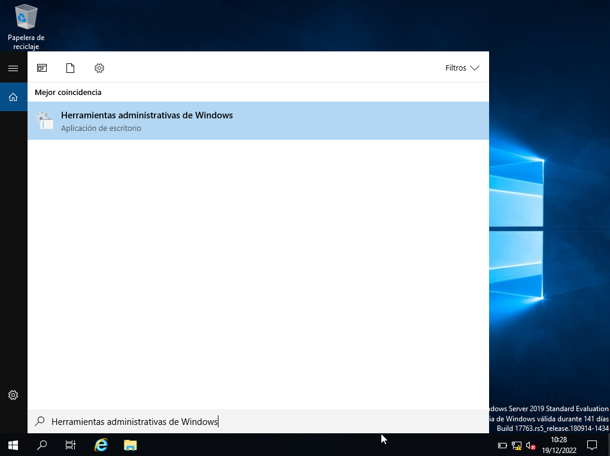

A continuación, se explicarán algunas de las **herramientas más utilizadas**:

- En primer lugar, encontramos **Administración de equipos**. Esta herramienta permite administrar y configurar diversas opciones del controlador de dominio.

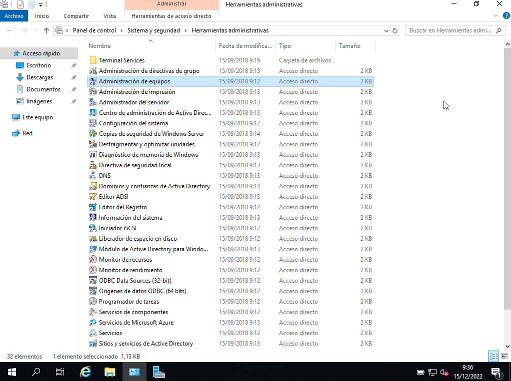

Una vez accedemos a Administración de equipos, aparecerá la siguiente ventana, la cual muestra un menú con varias opciones, entre las que encontramos: **Herramientas del sistema**, **Almacenamiento** y **Servicios y aplicaciones** como las principales.

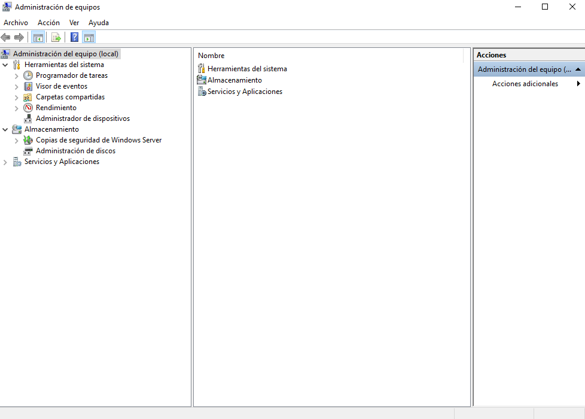

Dentro de las **Heramientas del sistema** encontramos diferentes opciones:

- **Programador de tareas**, que tal y como indica su nombre, permite **programar tareas o acciones rutinarias** para que se **ejecuten de forma automática**, a una **hora determinada**, etc. Aparecerá la siguiente ventana:

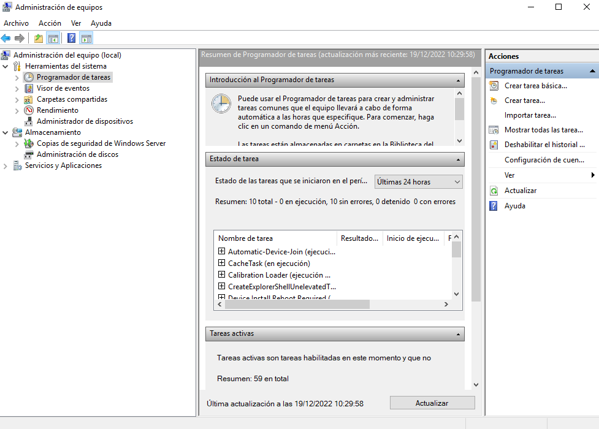

- La siguiente opción se trata de **Visor de eventos**. Se utiliza para **visualizar diferentes sucesos** ocurridos en el sistema, como **fallos de inicio de sesión**, **fallos de apagado**, fallos de servicios o aplicaciones. En la imagen que se muestra aparece el menú que ofrece esta opción.

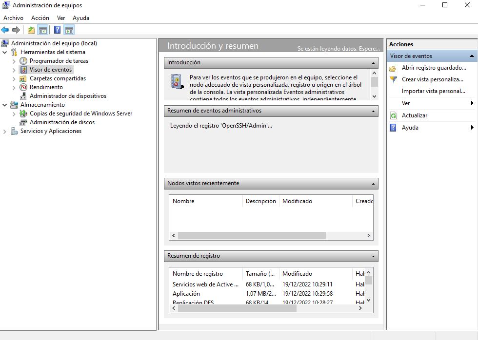

- A continuación, se encuentran las **Carpetas compartidas**, donde encontramos tres subcarpetas denominadas **Recursos compartidos**, **Sesiones** y **Archivos abiertos**. El propio nombre de cada una indica de qué se trata, es decir, **recursos**, **sesiones** y **archivos abiertos compartidos**, de esta forma nos será sencillo saber **qué tenemos compartido** y su correspondiente **ubicación**.

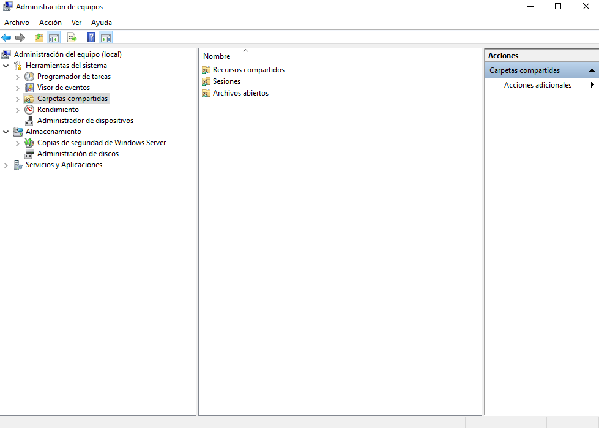

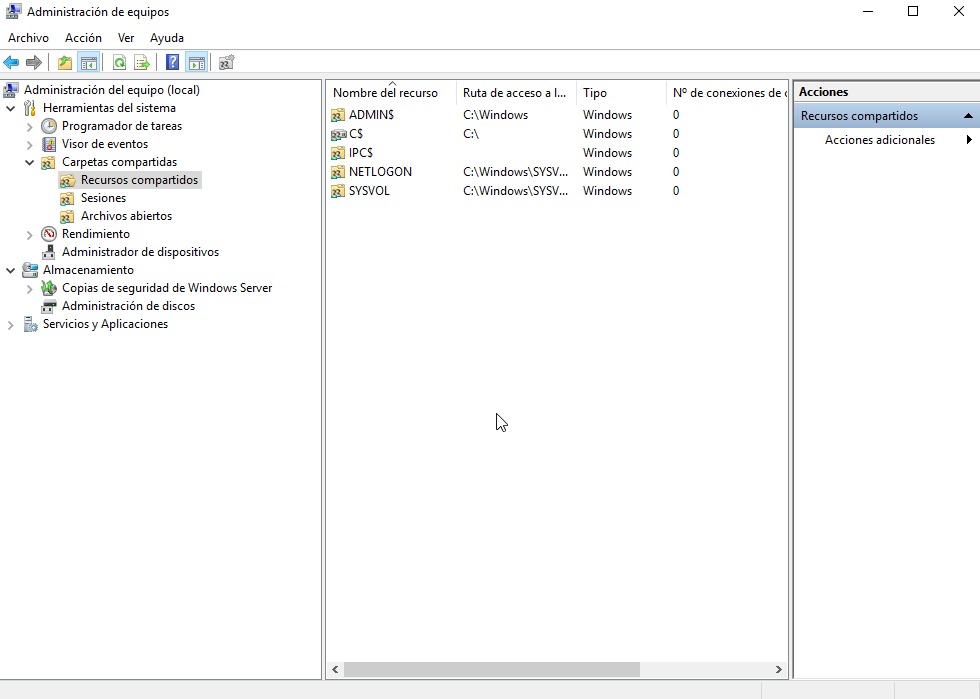

- **Rendimiento**: Esta opción permite **monitorizar el rendimiento de los recursos hardware** (CPU, memoria, etc.) y los **recursos del sistema** en **tiempo real**.

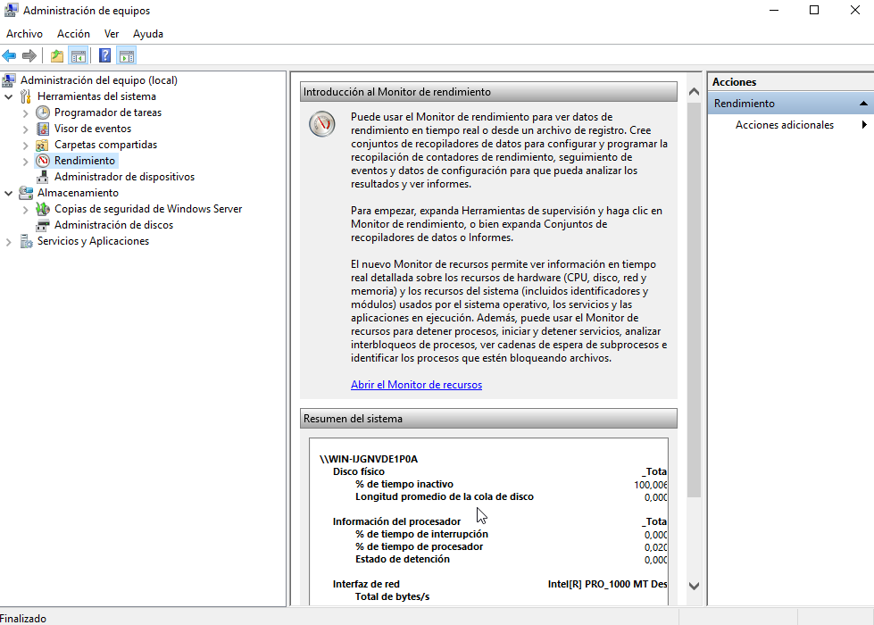

- Por último, respecto a las **Heramientas del sistema**, encontramos **Administración de dispositivos**. Esta herramienta nos permite **gestionar los periféricos conectados a nuestro equipo** (monitores, teclados, ratones, etc.), es decir, **actualizar su controlador**, **deshabilitar los dispositivos** e incluso **desinstarlarlos**.

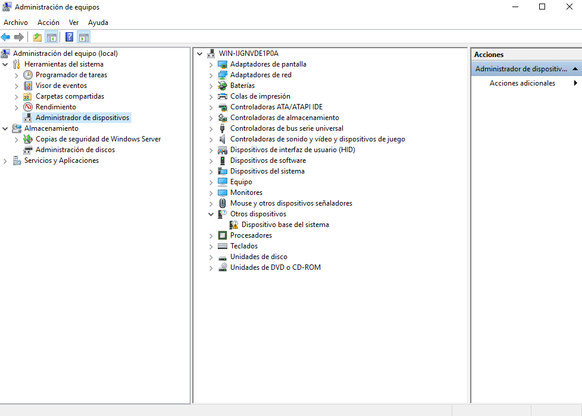

- Otra de las opciones que podemos observar en **Administración de equipos** se trata de **Almacenamiento**. En esta sección podemos gestionar las **copias de seguridad** y la **administración de discos**. Nos posibilita la opción de realizar una **copia de seguridad local** donde se almacenarán diversos archivos o aplicaciones. En Administración de equipos encontramos las opciones **Copias de seguridad de Windows Server** y **Administración de equipos**.

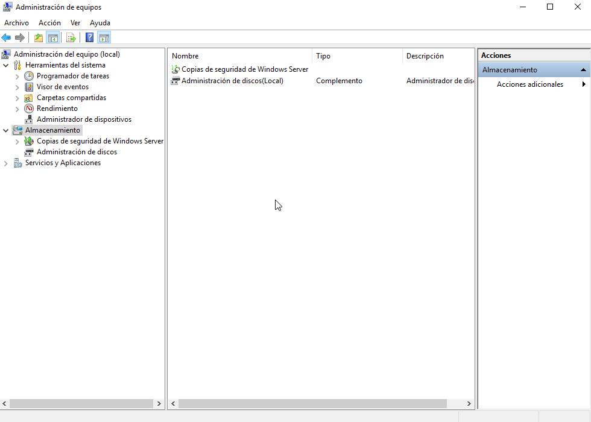

- La última opción que encontramos dentro de **Administración de equipos** es **Servicios y Aplicaciones**. Aquí se mostrára un **listado de los servicios que contiene nuestro servidor** con su respectivo **nombre**, **descripción**, **estado** y **tipo**. Asimismo, tenemos la posibilidad de realizar ciertas acciones como **reiniciarlos**, **detenerlos** o **actualizarlos**.

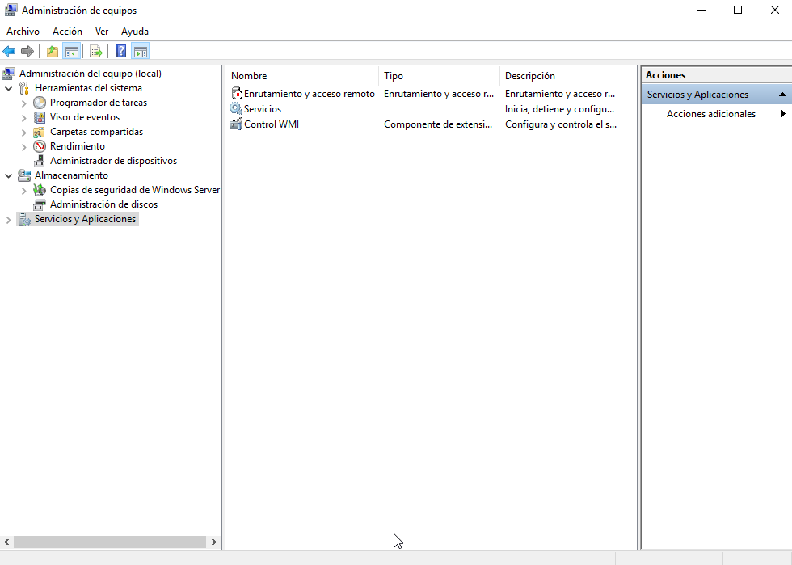

---

- A continuación, encontramos **Configuración del sistema**. Esta herramienta nos permite **configurar el inicio del sistema de Windows Server** para que arranque sin ningún tipo de inconveniente. Podemos elegir entre **tres tipos** de inicio:
    - **Inicio normal**: Carga **todos los controladores de dispositivo**, al igual que los **servicios**.
    - **Inicio con diagnóstico**: Carga los **dispositivos** y **servicios imprescindibles**.
    - **Inicio selectivo**: Carga los **servicios del sistema** y **elementos de inicio**.

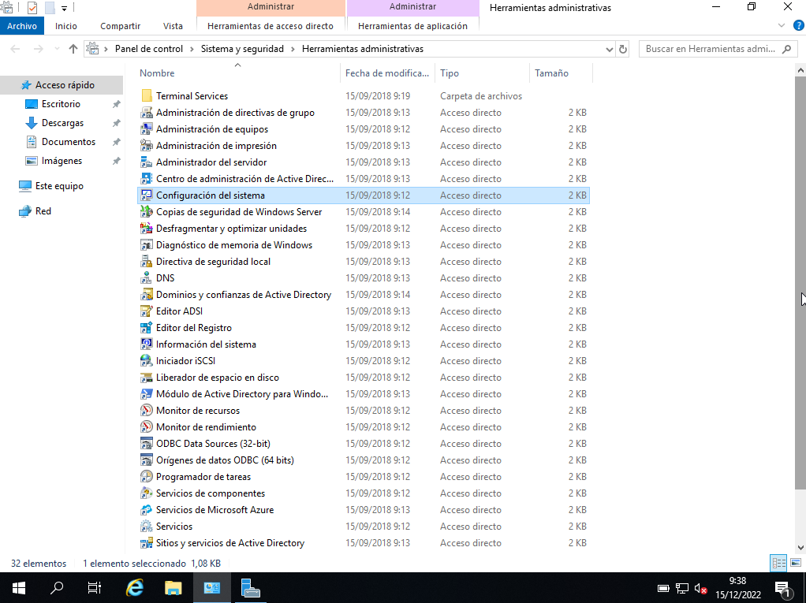

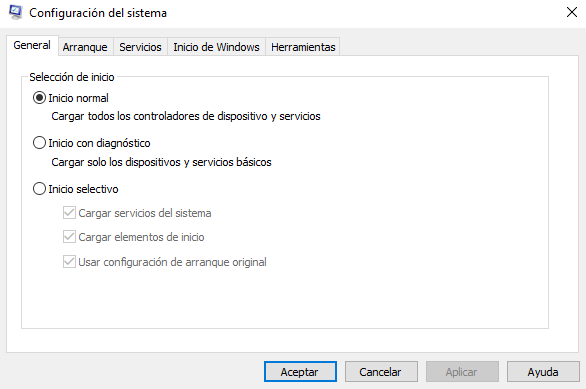

---

- La siguiente herramienta es **Centro de administración de Active Directory**, la cual funciona a través de **PowerShell** y nos **permite gestionar diferentes funcionalidades de un directorio**. Dentro de esta herramienta podemos observar **información general de nuestro Active Directory**, como por ejemplo, usuarios, grupos, equipos, unidades organizativas, dominios, etc. Además, su diseño **permite implementar paneles de forma personalizada**. Por último, **incorpora documentación** y los pasos a seguir para llevar a cabo diversas **tareas de administración del Active Directory**.

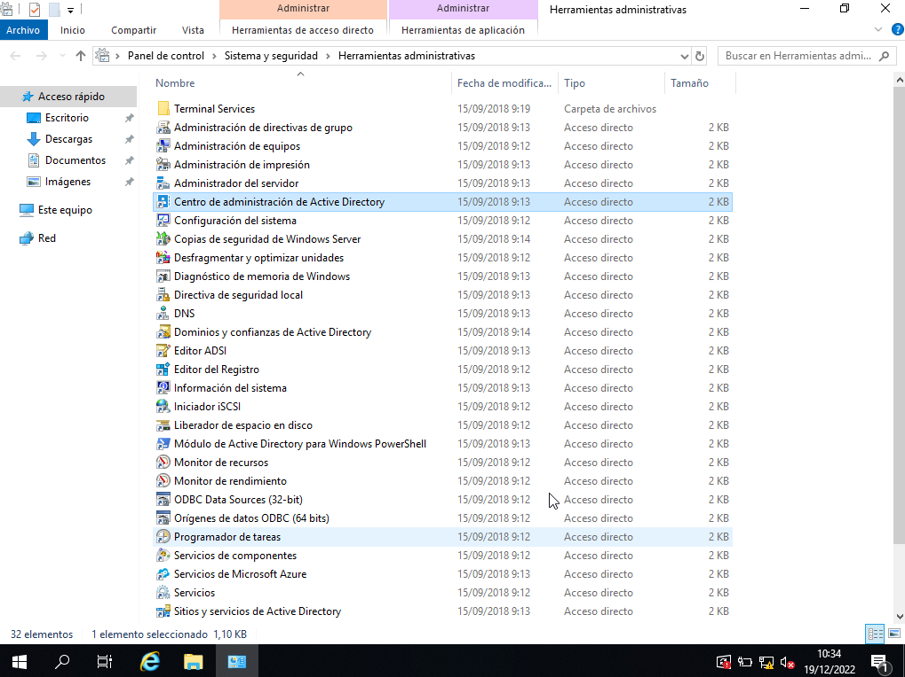

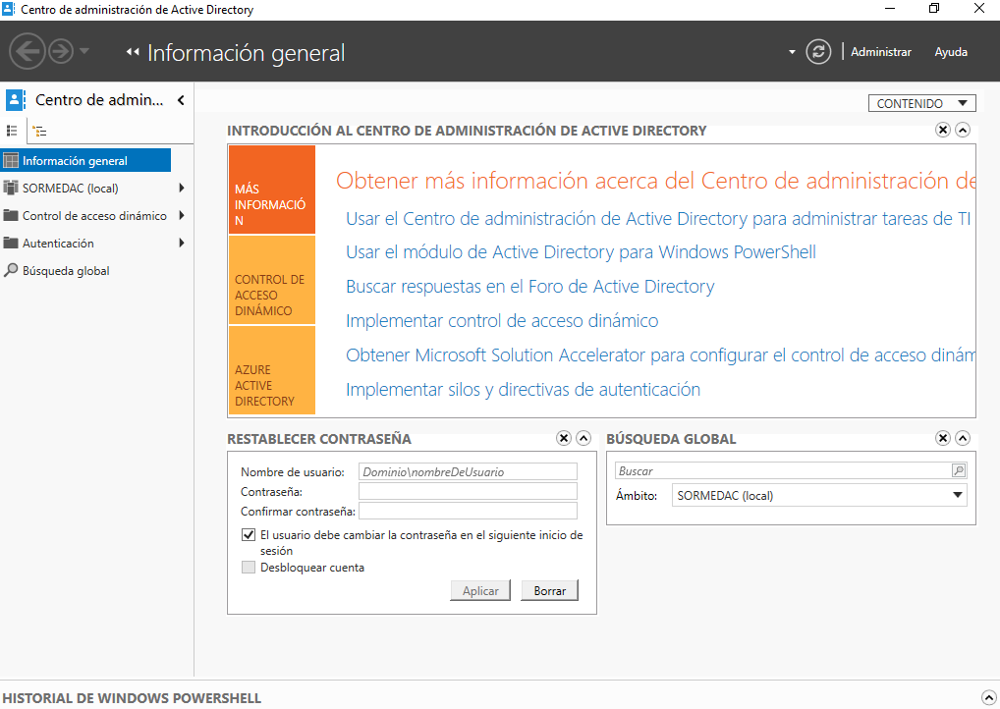

---

- La última herramienta es **Liberador de espacio en disco**, con la cual podemos realizar una **limpieza del disco duro** eliminando lo siguiente:
    - **Archivos temporales de Intenet y Windows**.
    - **Archivos de descarga de programas**.
    - **Archivos que se encuentan en la Papelera de reciclaje**.
    - **Archivos en caché**.
Además, es capaz de **comprimir archivos** que no son usados habitualmente con el objetivo de **disminuir el almacenamiento**.

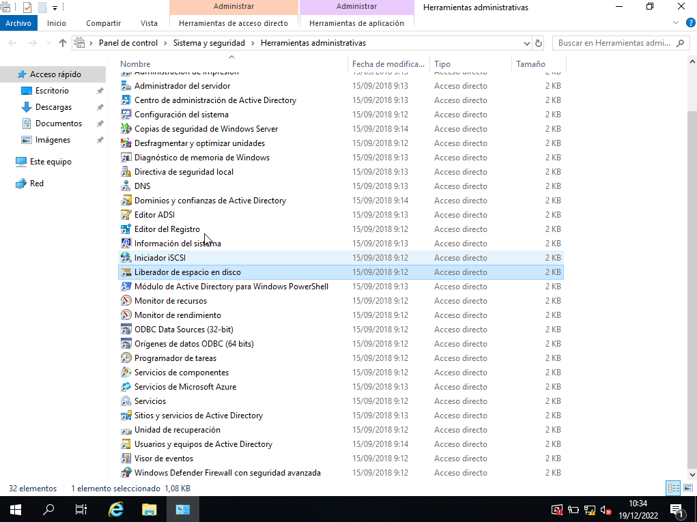

Al acceder a ella nos aparecerá la siguiente ventana, indicando que está **calculando la cantidad de espacio que se puede liberar del disco duro**:

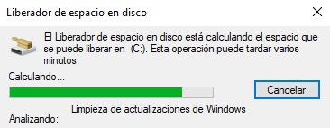

Una vez haya terminado el proceso anterior, veremos esta ventana, la cual expone un **listado con los diferentes archivos** que se pueden **eliminar**, así como su **tamaño**:

---

Las herramientas usadas frecuentemente pueden **agruparse** utilizando el **complemento Microsoft Management Console** (**MMC**) para que de esta forma nos sea más sencillo usarlas. Estas agrupaciones se denominan **consolas** y son **guardadas en archivos con la extensión .msc**.
Para crear una nueva consola, debemos seguir estos pasos:
1. Para comenzar, debemos **acceder al complemento MMC**, para ello, haremos **clic derecho** sobre el **Inicio de Windows** y pulsaremos sobre **Ejecutar**.

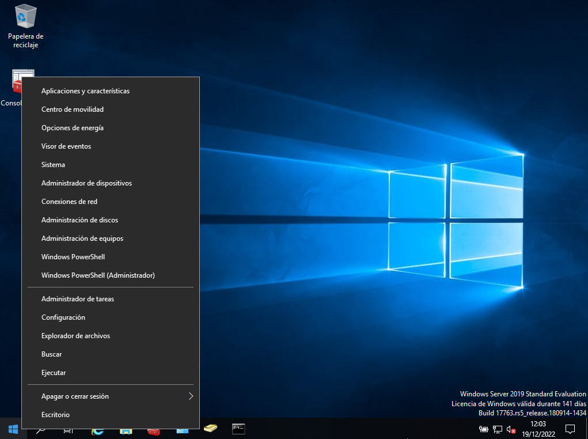

2. A continuación, se abrirá la **ventana Ejecutar** en la cual escribiremos **MMC** y posteriormente haremos clic sobre **Aceptar**.

3. Aparecerá la siguiente ventana: **Consola1 - [Raíz de consola]**. En la parte superior a la izquierda, veremos una serie de opciones,pulsaremos sobre **Archivo** y se abrirá un pequeño menú desplegable.

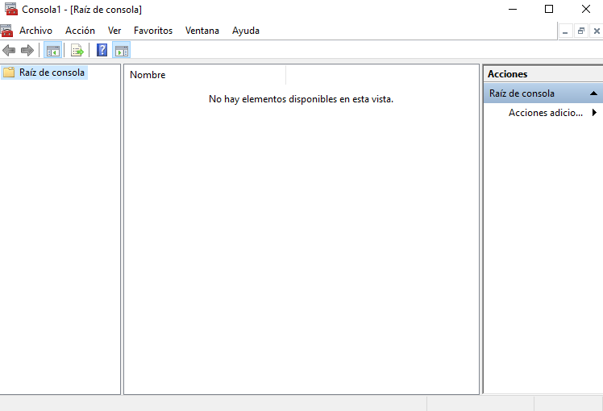

4. Una vez abierto el menú, podemos observar diversas opciones. Debemos hacer clic sobre **Agregar o quitar complementos...**. Esta opción nos permitirá **agregar** o **quitar complementos** de la consola.

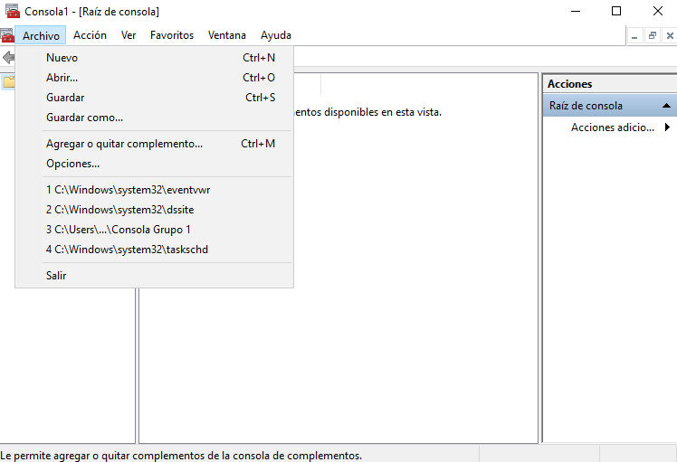

5. Se abrirá la siguiente ventana. En ella podremos **seleccionar los complementos que queramos agregar a la consola**. Empezaremos añadiendo **Administración de impresión**. Para hacerlo, **seleccionamos el complemento** y pulsamos sobre **Agregar >**.

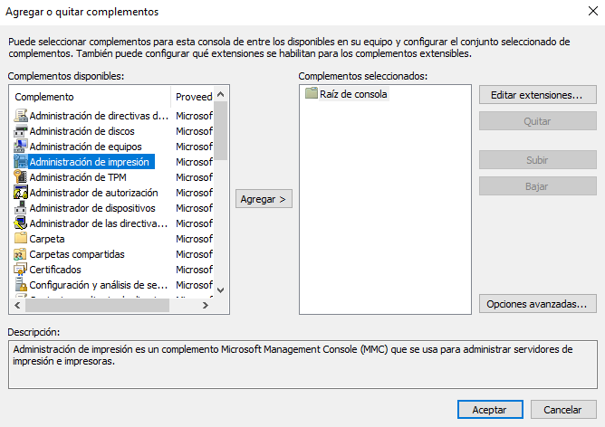

Una vez hacemos clic sobre **Agregar >**, veremos una nueva ventana llamada **Configurar Administración de impresión**. En ella podremos escribir el nombre del **servidor** el cual queremos que **administre el complemento**. En este caso lo he dejado en blanco. Pulsamos **Finalizar**.

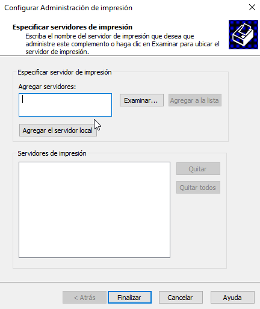

6. El siguiente complemento que debemos añadir es **Carpetas compartidas**. Seguimos el paso anterior y le damos a **Agregar >**.

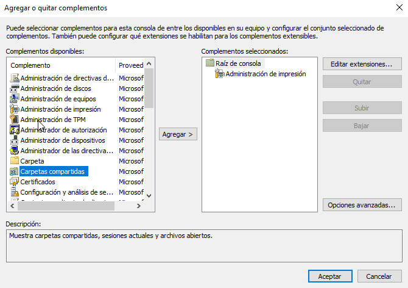

En la siguiente ventana podremos **seleccionar el equipo que deseamos administrar con dicho complemento**. Se han dejado las opciones que aparecen por defecto, es decir, en **Este complemento siempre administrará:** he seleccionado **Equipo local (el equipo en el que se está ejecutando esta consola):**, y en **Ver**, he elegido la primera opción, es decir, **Todo**. Una vez hecho, le damos a **Finalizar**.

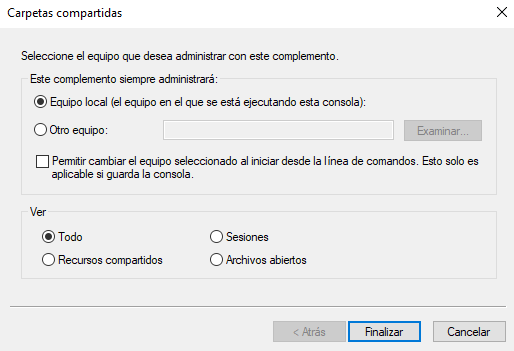

7. A continuación, debemos incluir el complemento **DNS**. Pulsamos sobre **Agregar >**. En este caso no se abrirá una ventana.

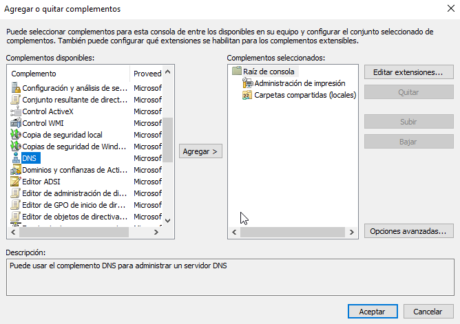

8. El complemento que debemos agregar ahora es **Servicios**. Lo sleccionamos y hacemos clic en **Agregar >**.

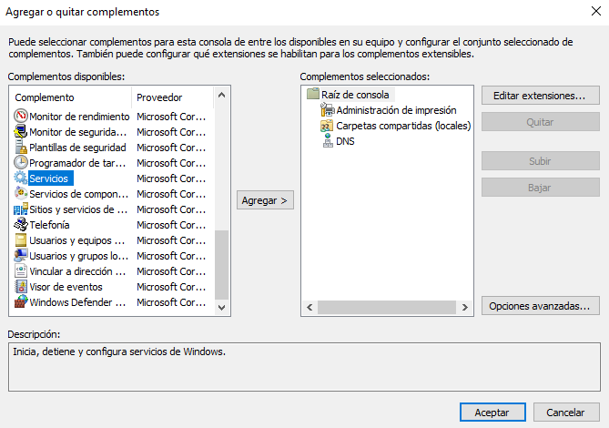

En este caso, aparecerá la siguiente ventana, la cual nos permite **seleccionar el equipo que vamos a administrar con este complemento**. En **Este complemento siempre administrará** he seleccionado la opción **Equipo local (el equipo en el que se está ejecutando esta consola)**. Pulsamos **Finalizar**.

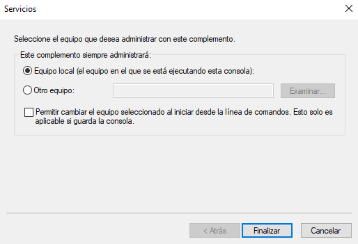

9. El último complemento se trata de **Visor de eventos**. Hacemos clic en **Agregar >**.

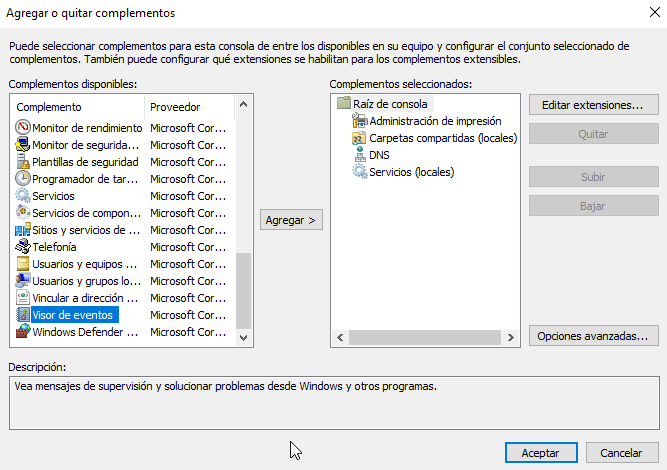

La ventana que aparecerá se llama **Seleccionar equipo**. En **Seleccione el equipo donde desea ver los registros del evento** he seleccionado lo siguiente: **Equipo local (el equipo donde se ejecuta esta consola)**. Pulsamos sobre **Aceptar**.

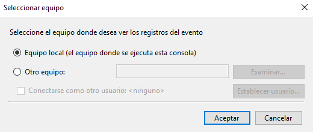

10. Una vez hecho, deberá verse así:

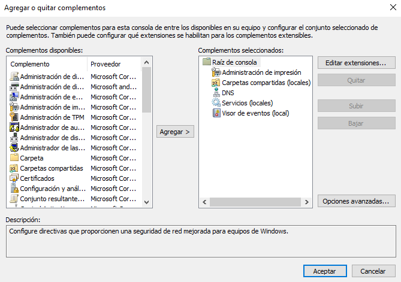

Pulsamos **Aceptar** para terminar el proceso.

11. Volveremos automáticamente a la ventana **Consola1 - [Raíz de consola]**. Ahora debemos **guardar la consola**, para ello, nos dirigimos a la opción **Archivo** del pequeño menú que encontramos a la izquierda en la parte superior. Una vez se ha abierto el menú desplegable, pulsamos en **Guardar como...**.

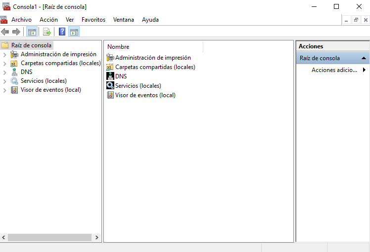

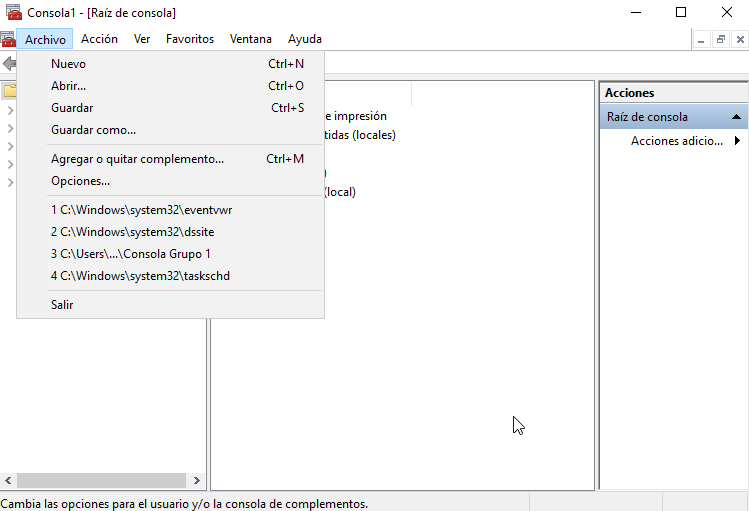

Al pulsar sobre **Guardar como...** veremos la siguiente ventana, en la cual debemos **escribir el nombre que tendrá en la consola**, que en este caso será **Consola Grupo 1**. Además, también debemos elegir **dónde se guardará el archivo**, como, por ejemplo, el **Escritorio**.

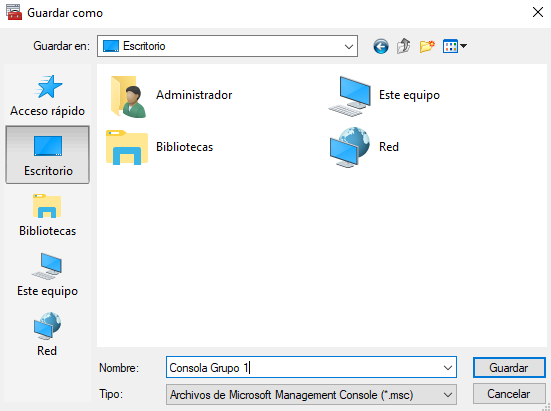

Por último, una vez se ha guardado la consola, nos dirigimos al **Escritorio** y lo veremos tal que así:

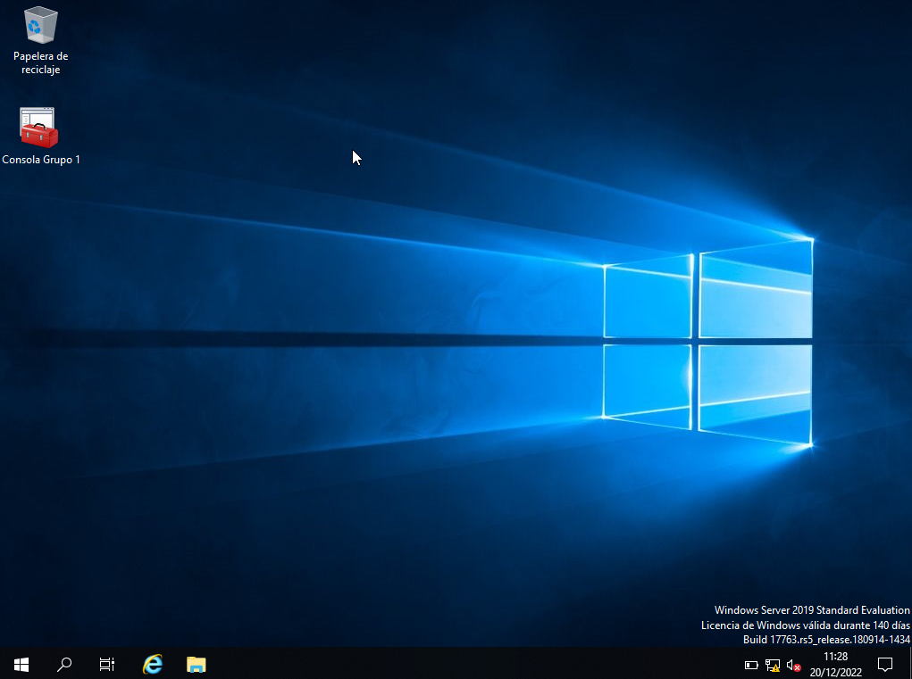

---

### Dominio y controlador de dominio.

La **creación de un dominio** y su **instalación** se pueden realizar mediante la **interfaz gráfica** o a través de **Windows PowerShell**. Este proceso se constituye de dos tareas:
- **Instalar el rol Servicios de dominio de Active Directory**.
- **Convertir el servidor en un controlador de dominio**.

A continuación, se explicará la **creación** e **instalación** de un dominio de **ambas formas**:

- **Instalación desde la interfaz gráfica**:
En primer lugar, hacemos clic en el botón de **Inicio de Windows** y buscamos **Administrador del servidor**. Una vez en Administrador del servidor, nos dirigimos a **Agregar roles y características**.

Se abrirá el **asistente**, donde posteriormente deberemos seleccionar el tipo de instalación, que en este caso la opción que vamos a escoger es **Instalación basada en características o roles**. Pulsamos **Siguiente**.

Una vez hecho el paso anterior, se nos pedirá seleccionar el **servidor en el cual queremos instalar el dominio**, que será el servidor donde trabajamos, por tanto, lo **seleccionamos** y **continuamos el proceso**.

Instalamos el rol **Servicios de dominio de Active Directory**. Hacemos clic en **Siguiente**.

Por último, el asistente nos mostrará algunos de los roles los cuales no hemos seleccionado y son necesarios, por lo que pulsamos **Agregar características** para añadirlas automáticamente. Proseguimos con el proceso de instalación haciendo clic en **Siguiente** y **reiniciando el equipo** cuando sea necesario.

- **Instalación mediante Windows PowerShell**:
Para acceder al **Windows PowerShell**, clicamos sobre el botón **Inicio de Windows** y procedemos a buscar **Windows PowerShell**. 

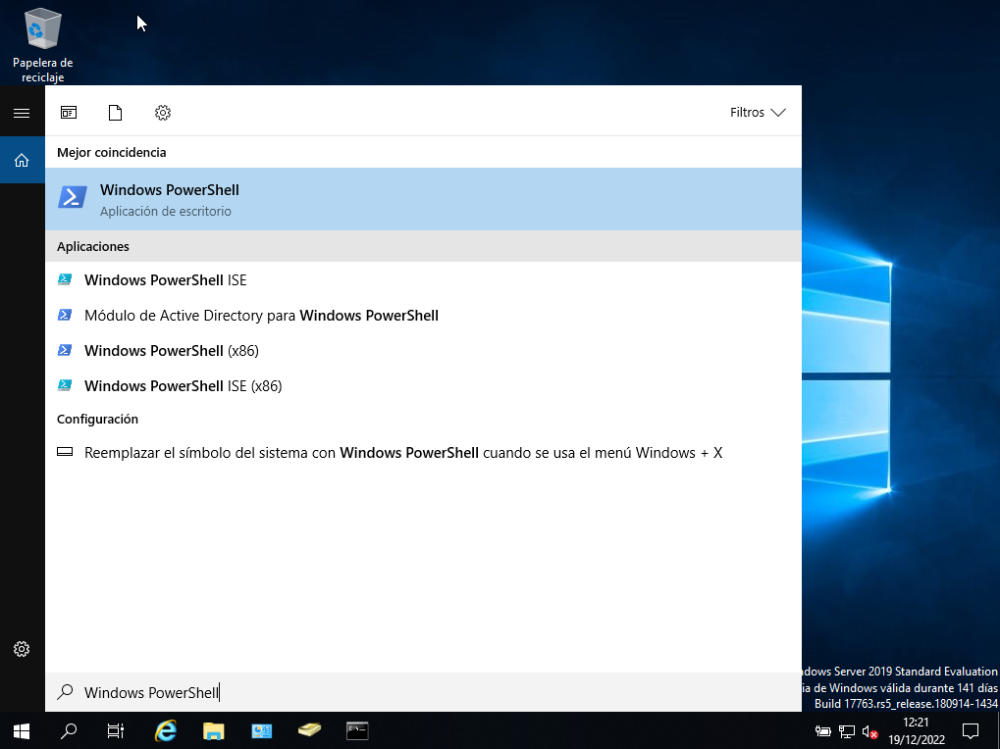

Se abrirá la ventana **Administrador: Windows PowerShell**:

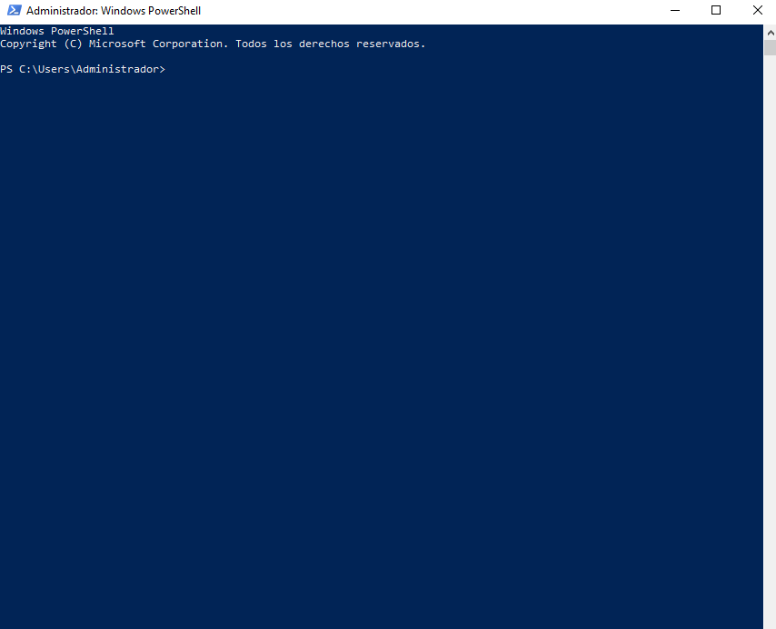

Una vez estamos en Windows PowerShell, escribimos el siguiente **comando**:

    Install-windowsfeature -Name AD-Domain-Services -IncludeManagementTools

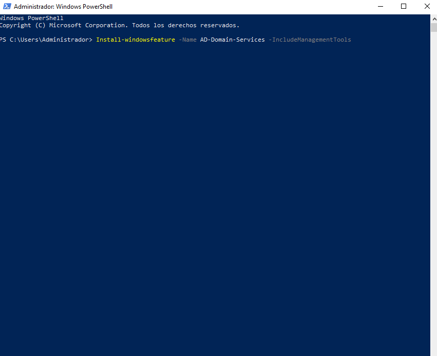

Pulsamos la tecla **Enter** y, en caso de que se haya realizado correctamente, deberá aparecer lo siguiente:

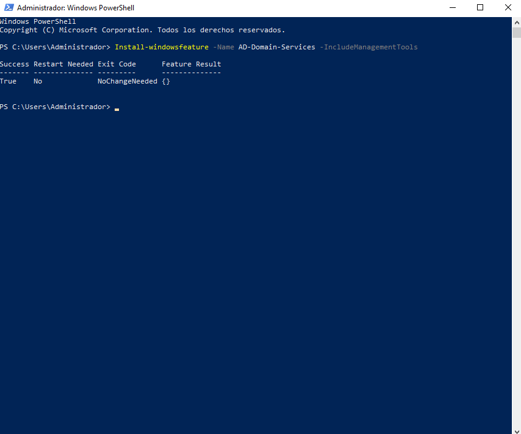

---

Una vez hemos creado e instalado el rol de Servicios de dominio de Active Directory, debemos **convertir el servidor como controlador de dominio**, es decir, **promover el servidor como controlador de dominio**. Asimismo, tenemos la posibilidad de hacerlo a través de la **interfaz gráfica** o mediante **Windows PowerShell**.

- **Promover el servidor como controlador de dominio mediante la interfaz gráfica**:

Para comenzar con el proceso, hacemos clic en el botón de **Inicio de Windows** y escribimos lo siguiente: **Administrador del servidor**.

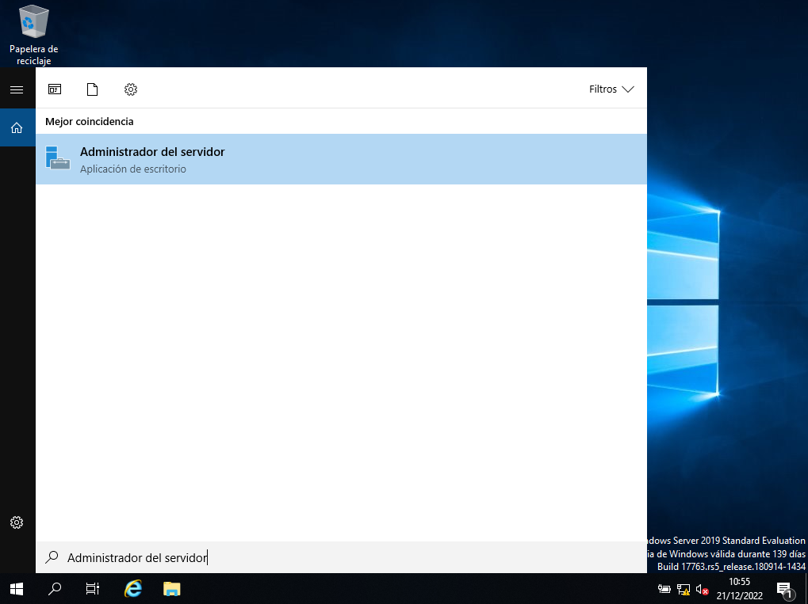

Pulsamos la tecla **Enter** y se abrirá la ventana correspondiente.

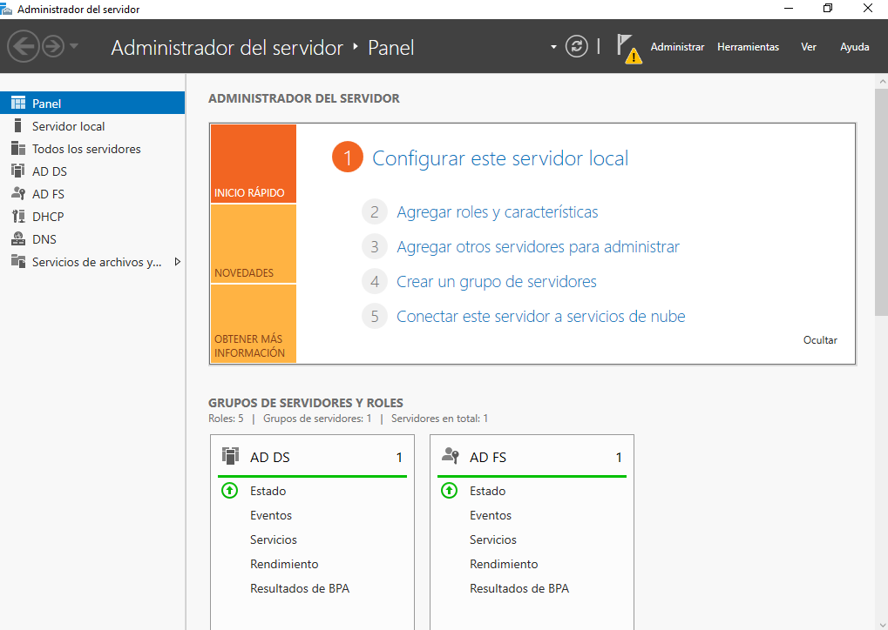

En Administrador del servidor podemos observar un **pequeño menú** en la parte superior izquierda. Aparece una **bandera** con un **símbolo de advertencia**. Pulsamos sobre ese símbolo y veremos diferentes advertencias. Clicamos sobre **Promover este servidor a controlador de dominio**.

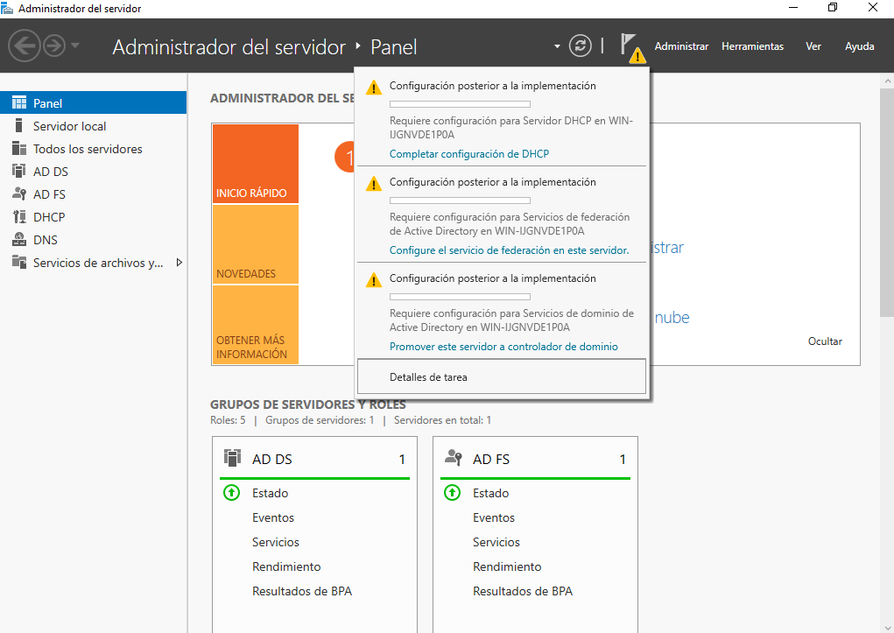

Se abrirá el **Asistente para configuración de Servicios de dominio de Active Directory**. Comenzaremos con la configuración. En primer lugar, deberemos **seleccionar la operación de implementación** y posteriormente escogeremos la opción **Agregar un nuevo bosque**. A continuación, en **Nombre de dominio raíz** escribiremos el nombre que nos indica el campo, que en este caso es **SORMEDAC.GRUPO1**. Clicamos **Siguiente >**.

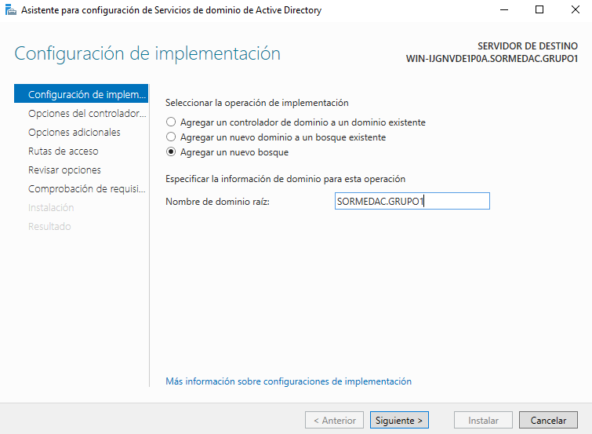

Continuando con el proceso, debemos **selecionar el nivel funcional del nuevo bosque y dominio raíz**, es decir, en cambos casos, **Windows Server 2016**. En cuanto a **Especificar capacidades del controlador de dominio**, escogemos las dos primeras opciones, es decir, **Servidor de Sistema de nombres de dominio (DNS)** y **Catálogo global (GC)**. Por último, es importante **escribir una contraseña de modo de restauración de servicios de directorio (DSRM)**, la cual es **Administrador1234**. Pulsamos **Siguiente >**.

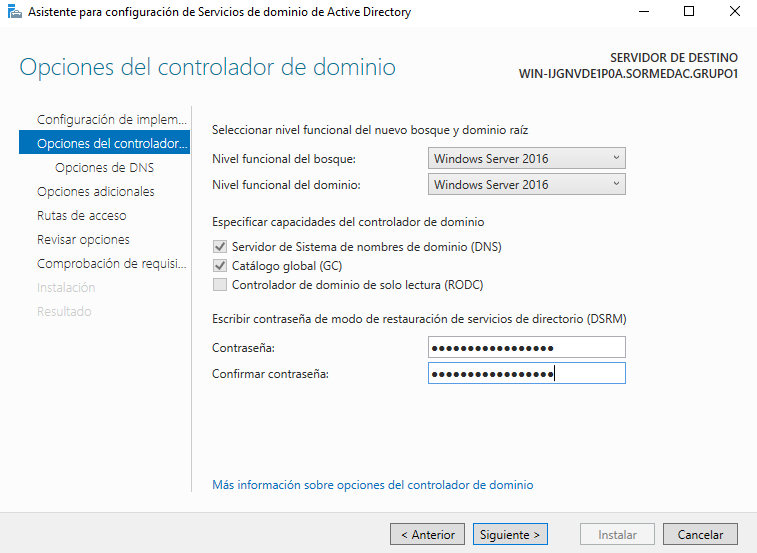

Lo único que debemos hacer en el siguiente apartado es clicar sobre **Siguiente >**.

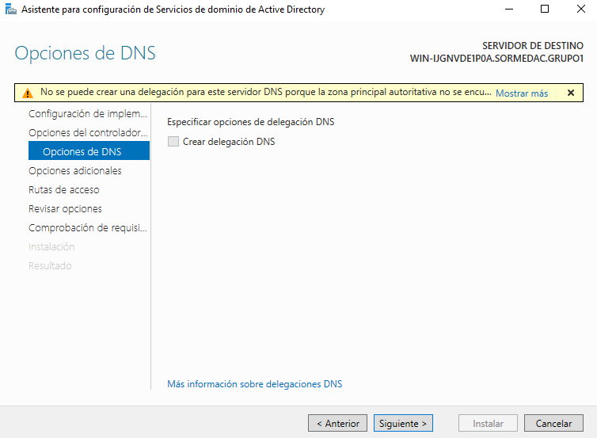

En **Opciones adicionales** debemos escoger el **Nombre de dominio NetBIOS**, el cual será **SORMEDAC**. Hacemos clic en **Siguiente >**.

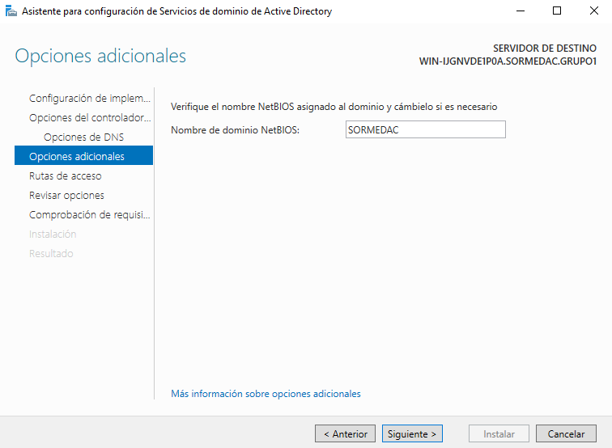

En **Rutas de acceso** dejamos las opciones que vemos **por defecto** y pulsamos **Siguiente >**.

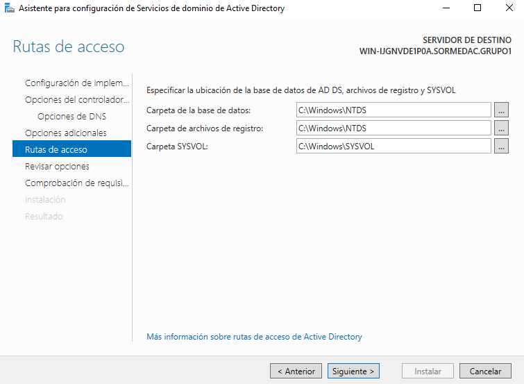

A continuacón, nos encontramos en **Revisar opciones**, lo único que debemos hacer aquí es darle a **Siguiente >**.

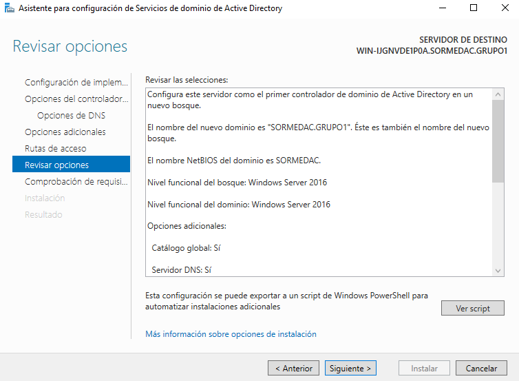

Posteriormente, en **Comprobación de requisitos previos**, hacemos clic en **Instalar** para comenzar la instalación.

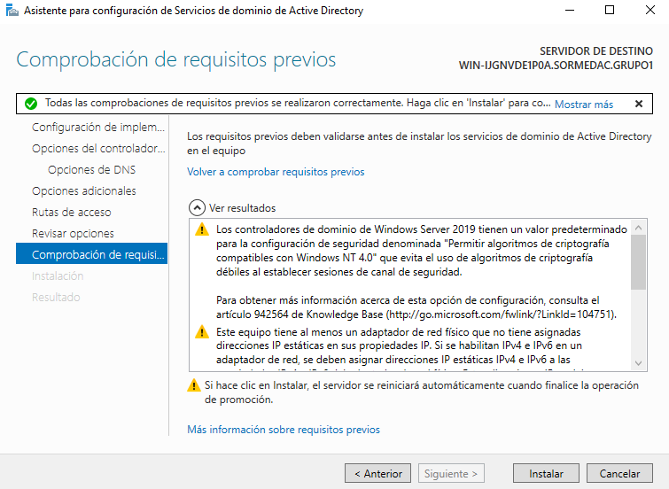

Por último, en **Resultado**, le daremos a **Cerrar** y en breves, comenzará el **reinicio del equipo**.

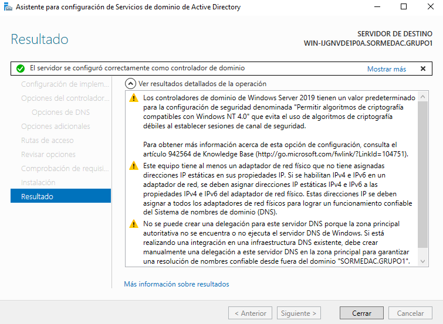

- **Promover el servidor como controlador de dominio mediante Windows PowerShell**:

Para comenzar, debemos acceder a **Windows PowerShell** de la misma forma que se ha explicado anteriormente. Únicamente utilizaremos **dos comandos**.

En primer lugar, una vez estemos dentro de Windows PowerShell, escribiremos el siguiente **comando**:
    Import-Module ADDSDeployment

Una vez escribamos el comando, nos dará paso a escribir el siguiente, el cual es:
    Install-ADDSForest

A continuación, nos pedirá el **nombre del dominio**, que es **SORMEDAC.GRUPO1** y su correspondiente **contraseña**, que es **Administrador1234**.

Una vez escrito y pulsado la tecla **Enter**, aparecerá un aviso indicando que **el servidor se va a convertir en un controlador de dominio**. Escribiremos **S**, que es un sinónimo de SÍ.

Una vez hayamos finalizado, se **reiniciará el equipo**.

---

***Degradar un controlador de dominio** tiene como objetivo **inhabilitar un controlador de dominio**. Para ello, es necesario **degradarlo** y **desinstalar los roles** implicados. Al igual que los procesos que hemos realizado anteriormente, se puede realizar a través de la **interfaz gráfica** o desde **Windows PowerShell**.

- **Degradar un controlador de dominio a través de la interfaz gráfica**:

Para comenzar, accedemos a **Administrador del servidor** y en el menú **Administrar**, hacemos clic en **Quitar roles y funciones**, una vez hecho, se abrirá el **asistente**. Debemos elegir un **servidor para actuar**, por lo que **elegiremos el servidor en el cual nos encontramos** y pulsamos sobre **Siguiente**. Posteriormente, en la ventana que se abrirá a continuación, **seleccionaremos los roles que queremos quitar**, que en este caso se trata de **Servicios de dominio de Active Directory**.

Posteriormente, nos indicará que **quitemos las características adicionales** y tras completar este paso debemos **Disminuir el nivel del controlador de dominio**, y pulsaremos en enlace que nos aparece.

Se abrirá el **Asistente para configuración de Servicios de dominio de Active Directory**, en esta ventana seleccionaremos la opción **Forzar la eliminación de este controlador de dominio**. Clicamos **Siguiente** en las ventanas posteriores.

Por último, será necesario escribir una **nueva contraseña** debido a que el **administrador dejará de ser el administrador del dominio** y se conventirá en **administrador local**.

Una vez finalice el proceso, se **reiniciará el equipo**.

- **Degradar un controlador de dominio a través de Windows PowerShell**:

Para comenzar, accedemos a **Windows PowerShell**.

En primer lugar, introducimos el siguiente **comando**:
    Import-Module ADDSDeployment

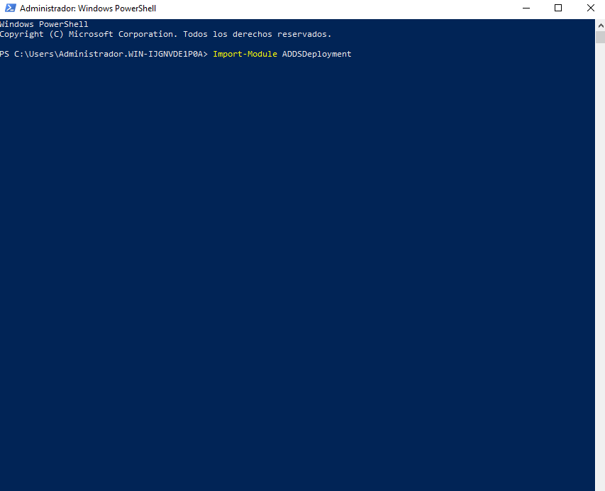

Posteriormente, introducimos el **comando**:
    Uninstall-ADDSDomainController -DemoteOperationMasterRole:$true -ForceRemoval:$true -Force:$true

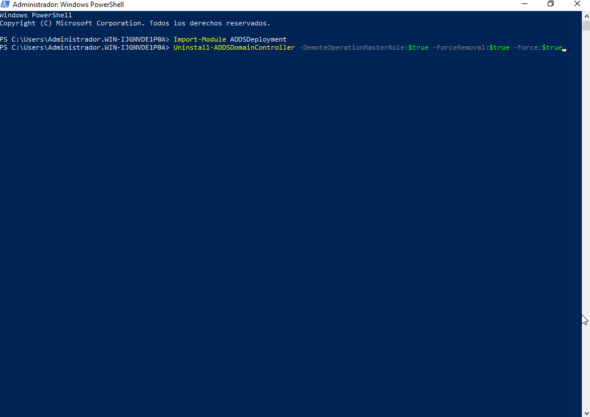

Pulsamos **Enter**, y a continuación nos indicará que escribamos la **contraseña del administrador local**, que en este caso es **Administrador1234**.

Por último, una vez hayamos completado los pasos anteriores y pulsemos la tecla **Enter**, veremos el siguiente mensaje indicando que todo el **proceso se ha realizado correctamente**. Posteriormente, se **reiniciará el equipo**.

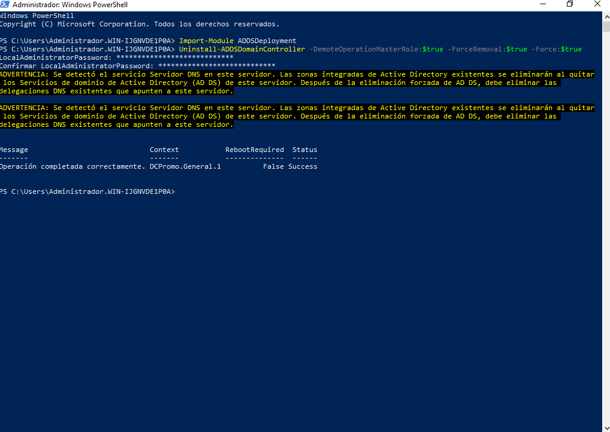